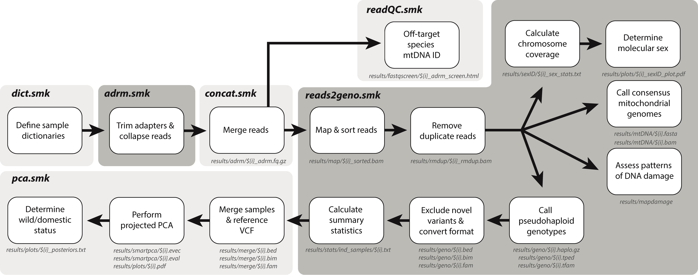

## **Introduction**
The Domestic Identification or `DomID` workflow takes paired-end screening data (<10M reads) as input, and accurately determines the taxonomic status (wild or domestic) of each ancient sample based on a modern reference panel, as well as calculating a suite of summary statistics (Fig. 1). The following wild and domestic taxa can be discriminated with `DomID`: 
- :dog2: ***Canis:*** Wolf and Dog
- :cow2: ***Bos:*** Aurochs and Cattle
- :pig2: ***Sus:*** Wild Boar and Pig
- :rabbit2: ***Oryctolagus:*** Wild and Domestic Rabbit
- ***Mustela:*** Polecat and Ferret

## **Citation**
The manuscript which presents `DomID` is currently in preparation. In the meantime, please cite this workflow as follows: 
- Scarsbrook, L. 2025. Domestic Identification (DomID) Workflow. GitHub. https://github.com/lachiescarsbrook/DomID.

## **Workflow Overview**

**Figure 1.** Overview of the `DomID` workflow, showing the function and output of each `snakemake` rule contained within the six modules.
<br>
<br>

## **Setup**
### **Install Snakemake using Conda/Mamba**
`DomID` utilises the `snakemake` workflow. The following four steps outline the installation of `snakemake` using the package managers `conda` and `mamba`.

- **1.** Install the [Miniconda](https://docs.anaconda.com/free/miniconda/#quick-command-line-install) package manager (if required) following the command line installation for your operating system. 

- **2.** Install [`mamba`](https://mamba.readthedocs.io/en/latest/installation/mamba-installation.html) using `conda`:
```
conda install -n base -c conda-forge mamba
```

- **3.** Install [`snakemake`](https://snakemake.readthedocs.io/en/stable/getting_started/installation.html) using `mamba`:

```
mamba create -c conda-forge -c bioconda -n snakemake snakemake
```

- **4.** Activate the environment:

```
mamba activate snakemake
```

### **Clone the DomID Repository**
All of the rules, scripts, and environments required by this `snakemake` workflow can be downloaded from the `DomID` repository as follows: 
```
git clone https://github.com/lachiescarsbrook/DomID.git
cd DomID
```

To make all rules and scripts executable, permissions must be changed using:
```
chmod -R 770 workflow
```

### **Install ANGSD**
While most programs utilised by `DomID` can be installed through `mamba`, a direct download of the genotyping tool [`angsd`](https://www.popgen.dk/angsd/index.php/ANGSD) is required to ensure the workflow is compatible with both Lunix/MacOS operating systems:
```
cd workflow
git clone https://github.com/ANGSD/angsd.git 
cd angsd
git checkout 0.941
make
cd ../../
```

### **Download and Index the Reference Genome**
To ensure genotypes in each reference panel can be directly compared with the unknown samples, specific reference genomes must be dowloaded for each taxa.
- :dog2: ***Canis:*** A custom version of the [CanFam3.1](https://www.ncbi.nlm.nih.gov/datasets/genome/GCF_000002285.5) dog genome assembly, which has been modified to contain a Y-chromosome for sex determination. To download, ensure you are in the `DomID` directory, and use the following:

```
TAG="1.0"
TAXA="canis"

wget https://github.com/lachiescarsbrook/DomID/releases/download/${TAG}/${TAXA}.fa.gz -O ./workflow/files/${TAXA}.fa.gz
gunzip workflow/files/${TAXA}.fa.gz
```
- :cow2: ***Bos:***
- :pig2: ***Sus:***
- :rabbit2: ***Oryctolagus:***
- ***Mustela:***

**Note:** `TAG` should reflect the most up-to-date release, which can be found [here](https://github.com/lachiescarsbrook/DomID/tags). `TAXA` should reflect the genus of interest.   
<br>

The reference genome must then be indexed using [`bwa`](https://academic.oup.com/bioinformatics/article/25/14/1754/225615), which can be installed using `mamba`:

```
mamba create -c bioconda -n bwa bwa
mamba activate bwa
bwa index workflow/files/${TAXA}.fa
mamba deactivate bwa
```

### **Download the Modern Reference Panel**
For each taxa, we have released a reference panel (in binary PLINK format) containing biallelic transversional SNPs, which are used to determine the taxonomic status of each sample through a combination of PCA projection and discriminant function analysis. To download, ensure you are still in the `DomID` directory, and use the following:

```
TAG="1.0"
TAXA="canis"

wget https://github.com/lachiescarsbrook/DomID/releases/download/${TAG}/${TAXA}.bed -O ./workflow/files/${TAXA}.bed
wget https://github.com/lachiescarsbrook/DomID/releases/download/${TAG}/${TAXA}.bim -O ./workflow/files/${TAXA}.bim
wget https://github.com/lachiescarsbrook/DomID/releases/download/${TAG}/${TAXA}.fam -O ./workflow/files/${TAXA}.fam
wget https://github.com/lachiescarsbrook/DomID/releases/download/${TAG}/${TAXA}_sites -O ./workflow/files/${TAXA}_sites
wget https://github.com/lachiescarsbrook/DomID/releases/download/${TAG}/${TAXA}_sites.bin -O ./workflow/files/${TAXA}_sites.bin
wget https://github.com/lachiescarsbrook/DomID/releases/download/${TAG}/${TAXA}_sites.idx -O ./workflow/files/${TAXA}_sites.idx
```

### **Download the Mitochondrial Reference Database**
Finally, to ensure archaeological remains have not been misidentified, and thus stop the incorrect classification of unknown samples as off-target species, we have incorporated `fastqscreen` species identification using a set of mitochondrial reference genomes from taxa common in archaeological deposits. To download, ensure you are still in the `DomID` directory, and use the following:  

```
TAG="1.0"

wget https://github.com/lachiescarsbrook/DomID/releases/download/${TAG}/mtDNA_ref.zip -O ./workflow/files/
gunzip workflow/files/mtDNA_ref.zip
```

You are now ready to run `DomID`!
<br>
<br>

## **Quick Start**
The `DomID` workflow requires parameters specified in two user-modified files to run, both of which are located in the `config` directory:
<br>
<br>

**1.** `user_config.yaml`: used to set the `Run` name, and specify the paths to both the `sample_file_list.tsv` and the reference genome. There are several other optional parameters that can be modified, with descriptions available in the config file.

**Note:** make sure to **specify the desired taxon name** in the `path_to_reference_genome`and `SNP_panel` parameters (default: canis), as well as the number and name of chromosomes. 
<br>
<br>

**2.** `sample_file_list.tsv`: provides a tab- or space-delimited list of library names, sample names, and paths to the paired-end sequencing reads (which must have either the .fq.gz or .fastq.gz suffix)


| Library Name | Sample Name | Path |
|-----------|-----|--------|
| LS0001_A1 | NZ_Kuri | path/to/directory/with/reads |
| LS0001_A2 | NZ_Kuri | path/to/directory/with/reads |
| LS0002 | Australian_Dingo | path/to/directory/with/reads |

The `Library Name` string must exactly match the ID found in the name of the paired-end files (e.g. LS0001_A1_L001.fastq.gz). The `Sample Name` column can be used to combine reads from the same individual across multiple lanes or libraries, or simply to change the name of the files generated (must be <39 characters). 

**Note:** a header **must not be included** in the `sample_file_list.tsv`. 
<br>
<br>

Once the user-specific parameters have been specified in the `user_config.yaml` and `sample_file_list.tsv`, the workflow, which is defined in the `Snakefile`, can be executed using the following:

```
snakemake --unlock
snakemake --use-conda --cores 40
```
**Note:** the number of cores can be altered to maximise available CPU.
<br>
<br>

## **Output**
The main output of `DomID` are as follows:
- **Species Identification:** using eigenvector multiplication in `smartpca`, `DomID` projects unknown samples onto principal components (PC) calculated from modern reference panels of wild and domestic populations. A PC plot (PC1-2) is stored in the `results/plots` directory (`Run`_PCA_plot.pdf).
- **Sex Identification:** using the differential coverage across autosomes and sex chromosomes, `DomID` infers the molecular sex of unknown samples. An RX/RY plot is stored in the `results/plots` directory (`Run`_SexID_plot.pdf).
- **Non-Target Species Identification:** by running `fastqscreen` with a database of mitochondrial genomes from taxa common in archaeological deposits, `DomID` ensures the unknown samples do not derive from non-target species.

### **Sample Summary Statistics**
For each `Sample`, the following statistics are also calculated, with the output stored in the `results/stats/` directory:
<br>
- `Total_Reads`: number of collapsed reads. 
- `Mapped_Reads_NoDup`: number of collapsed reads which mapped to the reference genome, excluding PCR duplicates. 
- `Mapped_Reads_Q30_NoDup`: number of collapsed reads which mapped to the reference genome, excluding PCR duplicates and reads with mapping quality <30.
- `Duplicates`: percentage of reads representing PCR duplicates.
- `mtDNA_Reads`: number of collapsed reads which map to the mitochondrial genome.
- `mtDNA_Depth` `mtDNA_Breadth`: average depth and breadth of coverage across the mitochondrial genome.
- `SNPs`: number of pseudohaploid SNPs called against reference panel.
- `Mapped_Length_Mean` `Mapped_Length_SD`: mean length and standard deviation of mapped collapsed reads.
- `All_Length_Mean` `All_Length_SD`: mean length and standard deviation of all collapsed reads.
- `C-toT` `G-to-A`: percentage of 5' C-to-T and 3' G-to-A nucleotide substitutions.
- : percentage of  nucleotide substitutions.
- `RX` `RX_Min` `RX_Max`: mean, minimum and maximum number of reads aligned to the X chromosome as a fraction of the expected aligned reads based on autosomal coverage.
- `RY` `RY_SE`: mean and standard error for the number of reads aligned to the Y chromosome as a fraction of the total number of alignments to both sex chromosomes. 
- `fastqscreen_Species`: species with the most number of mtDNA hits.
- `fastqscreen_Difference`: percentage difference in the number of mtDNA hits to the target species and the top hit (should be 0).
- `fastqscreen_Hits`: highest number of mtDNA hits.
